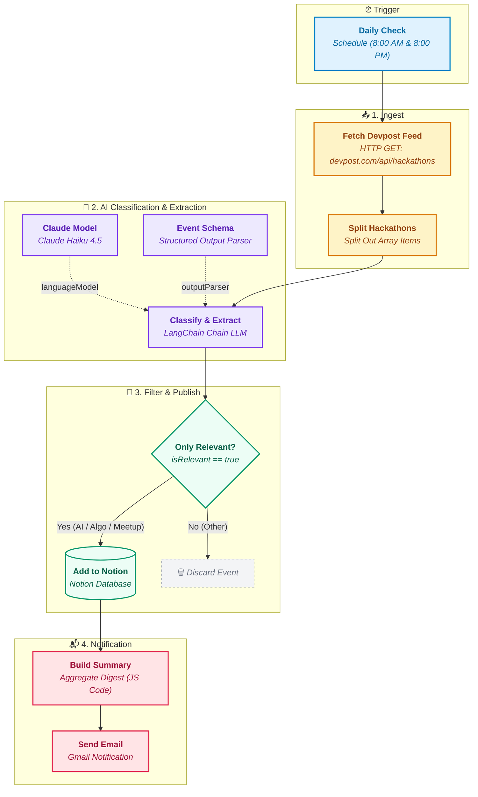

# Hackathon Finder n8n Agent

An intelligent, automated **n8n workflow** that regularly monitors tech event platforms (such as Devpost), filters and classifies them using **Claude AI (Anthropic)** via LangChain, populates a structured **Notion Database**, and emails a formatted daily digest via **Gmail**.

---

## 📌 Overview

Keeping track of hackathons, algorithmic challenges, and tech meetups across different platforms can be noisy and time-consuming. This workflow automates the entire discovery, curation, and alerting pipeline:

1. **Automated Scraping/Ingestion**: Fetches newly posted, open hackathons from the Devpost API.
2. **AI-Powered Filtering & Extraction**: Uses Anthropic Claude with structured output parsing to filter specifically for:
   - 🤖 **AI / ML Hackathons**
   - ⚡ **Algorithmic & Competitive Coding Challenges**
   - 👥 **Tech Meetups**
   - 🏷️ Extracts key metadata (Title, Category, Registration Link, Dates, Required Tech Stacks).
3. **Database Sync**: Automatically creates organized entries inside your Notion database.
4. **Email Digest**: Generates a consolidated summary and sends an email notification with all newly detected opportunities.

---

## 🏗️ Workflow Architecture



---

## 🧩 Pipeline Stages

| Stage | Node Name | Type | Description |
| :--- | :--- | :--- | :--- |
| **Trigger** | `Daily Check` | Schedule Trigger | Runs automatically twice a day (8:00 AM & 8:00 PM). |
| **Ingest** | `Fetch Devpost Feed` | HTTP Request | Queries `https://devpost.com/api/hackathons` for recent, open events. |
| | `Split Hackathons` | Split Out | Splits the JSON array of hackathons into individual items. |
| **Classify** | `Classify & Extract` | Chain LLM | LangChain node parsing each event against relevancy guidelines. |
| | `Claude Model` | Anthropic Chat Model | Uses `claude-haiku-4-5` for fast, cost-effective reasoning. |
| | `Event Schema` | Output Parser | Enforces structured JSON output matching defined schema. |
| **Publish** | `Only Relevant` | Filter | Drops irrelevant events (`isRelevant == false`). |
| | `Add to Notion` | Notion Node | Creates or updates pages in the target Notion database. |
| **Notify** | `Build Summary` | JavaScript Code | Aggregates all relevant events into a clean bulleted summary. |
| | `Send Email` | Gmail Node | Sends the digest email to your configured recipient inbox. |

---

## 📋 Structured Output Schema

The LLM extracts and formats each event using the following JSON schema:

```json
{
  "isRelevant": true,
  "category": "AI Hackathon", // "AI Hackathon" | "Algorithmic Challenge" | "Tech Meetup" | "Other"
  "title": "Example AI Global Challenge 2026",
  "registrationLink": "https://devpost.com/software/...",
  "dates": "Oct 15 - Oct 17, 2026",
  "techStacks": ["Python", "PyTorch", "Next.js", "LLMs"]
}
```

---

## 🛠️ Prerequisites & Setup

### 1. Requirements
- An active [n8n](https://n8n.io/) instance (n8n Cloud or Self-Hosted, v1.0+).
- **Anthropic API Key** (for Claude).
- **Notion Integration / OAuth** with access to your target database.
- **Google / Gmail OAuth2 Credentials** (for sending emails).

### 2. Notion Database Setup
Create a new database in Notion with the following properties:

| Property Name | Property Type | Description |
| :--- | :--- | :--- |
| **Name** / **Title** | Title | Event Title |
| **Category** | Select | Options: `AI Hackathon`, `Algorithmic Challenge`, `Tech Meetup` |
| **Registration Link**| URL | Direct link to the event or registration page |
| **Dates** | Rich Text | Event dates or deadline |
| **Tech Stacks** | Rich Text | Comma-separated list of technologies |

### 3. Import Workflow to n8n
1. In n8n, go to **Workflows** → **Import from File...**.
2. Select [`Hackathon Finder.json`](file:///Users/shivenkathuria/Desktop/Projects%20/hackathon-finder-n8n-agent/Hackathon%20Finder.json).
3. Connect your credentials:
   - **Anthropic Account**: Assign your Anthropic API key to the `Claude Model` node.
   - **Notion Account**: Authenticate OAuth2 and select your created Notion Database in `Add to Notion`.
   - **Gmail Account**: Connect your Gmail OAuth2 and set your destination email address in `Send Email`.
4. Toggle the workflow to **Active**.

---

## ⚙️ Customization

- **Adjust Schedule**: Change the trigger times in the `Daily Check` node (e.g., once a day, weekly, or hourly).
- **Change Categories & Prompts**: Modify the prompt in `Classify & Extract` or adjust `Event Schema` to track additional categories (e.g., Web3, Cybersecurity, Open Source).
- **Switch LLM Models**: Replace `Claude Model` with any other LangChain model node supported by n8n (e.g. OpenAI GPT-4o-mini, Google Gemini Flash, or local Ollama).
- **Alternative Notifications**: Replace `Send Email` with Slack, Discord webhook, or Telegram bot nodes.

---

## 📄 License

This project is licensed under the [MIT License](LICENSE) (or choose your preferred license).
